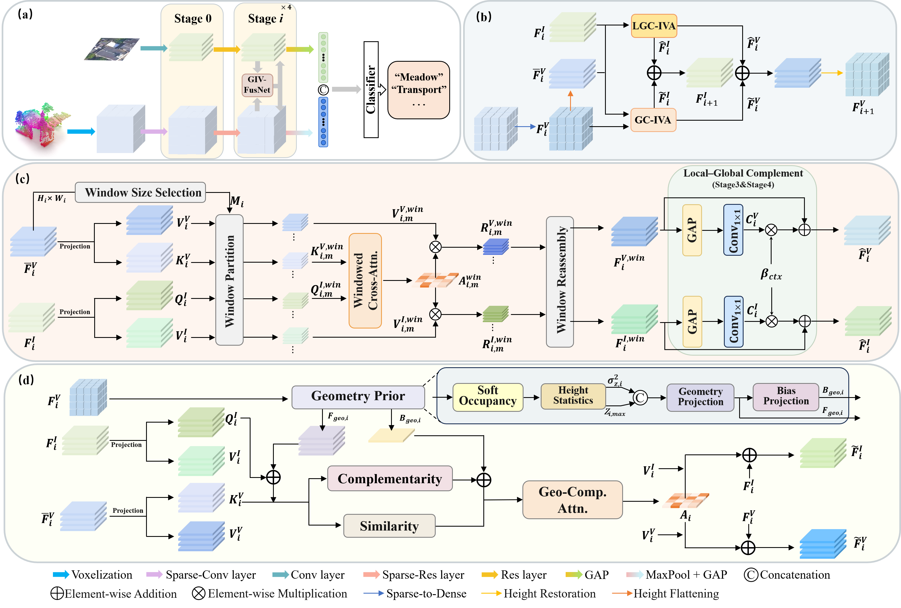

# GIV-FusNet: Geometry-Guided Image-Voxel Fusion Network for Multimodal Remote Sensing Scene Classification

This repository provides the implementation of **GIV-FusNet** for multimodal remote sensing scene classification using high-spatial-resolution (HSR) imagery and LiDAR point clouds.



> **Note:** The repository is currently being organized. The complete code and related files will be uploaded progressively.

## Environment Setup

Example environment: **CUDA 11.7, Python 3.8.20, PyTorch 1.13.1**.

```bash
conda create -n givfusnet python=3.8.20 -y
conda activate givfusnet

pip install torch==1.13.1+cu117 torchvision==0.14.1+cu117 \
    --extra-index-url https://download.pytorch.org/whl/cu117

pip install torchsparse==2.1.0
pip install numpy==1.23.5 scipy==1.10.1 scikit-learn==1.3.2
pip install pillow==9.5.0 tifffile==2023.7.10 tensorboard==2.14.0
pip install matplotlib==3.5.3 pandas==1.5.3 tqdm==4.67.1
```

## Dataset Preparation

We conduct experiments on **2D3DScene-Netherlands** and **2D3DScene-France**.

Dataset download:

https://www.scidb.cn/s/iEzamy

Each original sample contains `img.jpg` and `Point.txt`. In our experiments, they are preprocessed into `img.tiff` and `Point.npy`.

The datasets are **randomly split into training and testing sets at an 8:2 ratio**.

Example directory structure:

```text
Netherlands_train or Netherlands_test
├── transport
│   ├── 1
│   │   ├── Point.npy
│   │   └── img.tiff
│   └── ...
├── industrial area
├── office building
├── sport field
├── farmland
├── forest
├── residential area
├── church
└── meadow
```

The France dataset follows the same preprocessing and directory organization.

## Model Training

Set the dataset, environment, and output paths in the training script, then run:

```bash
bash run.sh
```

## Model Evaluation

Set the test dataset and checkpoint paths in the evaluation script, then run:

```bash
bash test.sh
```

Main results reported in the paper:

| Dataset | OA (%) | Kappa |
|---|---:|---:|
| 2D3DScene-Netherlands | 94.67 | 0.9400 |
| 2D3DScene-France | 93.56 | 0.9275 |

## Acknowledgments

This project is implemented based on [**PyTorch**](https://pytorch.org/), [**TorchVision**](https://pytorch.org/vision/stable/), and [**TorchSparse**](https://github.com/mit-han-lab/torchsparse), and follows the dual-branch image-voxel scene classification framework of [**IP-SceneNet**](https://github.com/treemanzzz/IP-SceneNet).

We thank the authors of these projects for their excellent work.

## LICENSE

This project is licensed under the [Apache License 2.0](LICENSE).

The datasets and third-party components used in this project are subject to their respective licenses and terms of use.
